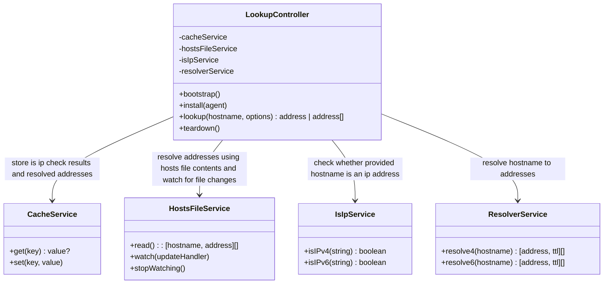

# ⚡ Super dns.lookup

NodeJS [dns.lookup][docs-dns-lookup] compatible function without threads pool usage,
with customizable cache, resolver, fallback strategies and hosts file support.

## 💡 Motivation

NodeJS built-in [dns][docs-dns] module has [dns.lookup][docs-dns-lookup] function to resolve domain names into ip addresses.
This built-in function appears to be default address resolution method for most network related modules of NodeJS.
It implicitly used every time:

- you make HTTP(S) request with [http.request][docs-http-request];
- or establish new connection with [Socket#connect][docs-net-socket-connect];
- or send data over UDP with [dgram.Socket#send][docs-dgram-socket-send].

Function [dns.lookup][docs-dns-lookup] seems to be asynchronous and non blocking.
But according to [implementation considerations][docs-dns-lookup-implementation],
[dns.lookup][docs-dns-lookup] calls synchronous [getaddrinfo][docs-getaddrinfo],
which performs via worker threads pool and defaylt pool size is 4 threads.

Threads pool turns in bottleneck when becomes busy by:

- slow DNS queries, e.g. when a DNS server is overloaded or an authoritative server issues;
- slow crypto, fs or zlib calls.

Please, consider reading of [Don't Block the Event Loop (or the Worker Pool)][docs-block-working-pool].

💡 The idea of this library is implement [dns.lookup][docs-dns-lookup] compatible function
which does not reply on threads pool, and it is based on [dns.resolve4][docs-dns-resolve4] and
[dns.resolve6][docs-dns-resolve6] functions. It is exactly what NodeJS documentation recommends to do.

New lookup function should be used to:

* Create new tcp connection while performing [http.request][docs-http-request]:
  ```ts
  import { request } from 'node:http';
  import { lookup } from 'super-dns-lookup';

  const req = request('https://example.com', { lookup }, (res) => {
    /* handle response */
  });
  req.end();
  ```
* Connect tcp socket via [net.Socket#connect][docs-net-socket-connect]:
  ```ts
  import { Socket } from 'node:net';
  import { lookup } from 'super-dns-lookup';
  
  const socket = new Socket();
  socket.connect('example.com', { lookup }, () => {
    socket.write('hello world');
    socket.end();
  });
  ```
* Create new datagram socket via [dgram.createSocket][docs-dgram-create-socket]
  for sending some data via [dgram.Socket#send][docs-dgram-socket-send]:
  ```ts
  import { createSocket } from 'node:udp';
  import { lookup } from 'super-dns-lookup';
  
  const socket = createSocket({ lookup });
  socket.send('hello world', () => {
    socket.close();
  });
  ```

## 📋 Features

* **dns.lookup compatible** - module provides function fully compatible with NodeJS's builtin [dns.lookup][docs-dns-lookup];
* **IP recognition** - recognize when host name is IP address and resolve it immediately without querying resolver;
* **Hosts file support** - ability to resolve host name based on [/etc/hosts][docs-etc-hosts];
* **Configurable resolver** - ability to set resolver service with interface like [resolve4][docs-dns-resolve4]/[resolve6][docs-dns-resolve6];
* **Built-in resolver without getaddrinfo** - ability to use builtin resolver which do not relay on [dns.lookup][docs-dns-lookup] and [getaddrinfo][docs-getaddrinfo];
* **Configurable cache** - ability to provide cache service with interface like set, get, list and delete;
* **Persistent cache** - ability to export cache into storage (file or service);
* **Built-in cache** - ability to use built-in cache, usually in memory cache;
* **Cache size** - ability to limit cache size. May require cache provider to support listing with paging;
* **Cache TTL** - ability to set TTL on cache records, based on A/AAAA records TTL. May require cache provider to support expiration method or ttl option of set method;
* **Cache lock** - ability to limit number of simultaneous queries for same host name to single query, and wait until current query response instead of firing new query;
* **Cache lock timeout** - ability to limit the time of waiting that current resolve query to be completed, before firing new query;
* **Cache round robin** - ability to store all IP addresses for given host name in cache, and reply with next IP in list on each next request of resolving same host name into single IP address;
* **Expired cache fallback** - ability to use expired cache as fallback when query ends up with error;
* **Cache failures** - ability to avoid query flood by caching `ENOTFOUND` and `ENODATA` response for some time;
* **Circuit breaker** - ability to avoid query flood by limiting communication with resolver for some time after `SERVFAIL` and `REFUSED` errors  or query timeout. May be based on caching failed query result for some time;
* **Installment API** - ability to install lookup function on [HTTP Agent](https://nodejs.org/api/http.html#class-httpagent) or even more;
* **Exports CommonJS, ESM, TypeScript** - ability to use CommonJS and ESM exports of package or TypeScript declarations.

## 📦 Alternatives

There are at least three alternatives:

* [better-lookup][package-better-lookup];
* [dns-lookup-cache][package-dns-lookup-cache];
* [cacheable-lookup][package-cacheable-lookup].

| Feature | ⚡ super-dns-lookup | [better-lookup][package-better-lookup] | [cacheable-lookup][package-cacheable-lookup] | [dns-lookup-cache][package-dns-lookup-cache] |
|:--|:--|:--|:--|:--|
| **dns.lookup compatible**                 | ❔ | ❎ [^1] | ❎ [^2] | ❎ [^3] |
| **IP recognition**                        | ❔ | ✅      | ❌      | ❌      |
| **Hosts file support**                    | ❔ | ✅      | ❌      | ❌      |
| **Configurable resolver**                 | ❔ | ❌      | ✅      | ❌      |
| **Built-in resolver without getaddrinfo** | ❔ | ✅      | ❎ [^4] | ✅      |
| **Configurable cache**                    | ❔ | ❌      | ✅      | ❌      |
| **Persistent cache**                      | ❔ | ❌      | ✅      | ❌      |
| **Built-in cache**                        | ❔ | ✅      | ✅      | ✅      |
| **Cache size**                            | ❔ | ❌      | ❌      | ❌      |
| **Cache TTL**                             | ❔ | ❎ [^5] | ✅      | ✅      |
| **Cache lock**                            | ❔ | ✅      | ❌      | ❌      |
| **Cache lock timeout**                    | ❔ | ❌      | ❌      | ❌      |
| **Cache round robin**                     | ❔ | ✅      | ❌      | ✅      |
| **Expired cache fallback**                | ❔ | ❌      | ❌      | ❌      |
| **Cache failures**                        | ❔ | ❌      | ❌      | ❌      |
| **Circuit breaker**                       | ❔ | ❌      | ❌      | ❌      |
| **Installment API**                       | ❔ | ✅      | ✅      | ❌      |
| **Exports CommonJS**                      | ❔ | ✅      | ❌      | ✅      |
| **Exports ESM**                           | ❔ | ✅      | ✅      | ❌      |
| **Exports TypeScript**                    | ❔ | ✅      | ✅      | ❌      |

[^1]: [better-lookup][package-better-lookup] supports only `all` (boolean) and `family` (`0`, `4` or `6`) options.
Options `hints` ([flags][docs-getaddrinfo-flags]), `order` (`verbatim`, `ipv4first`, `ipv6first`) and
deprecated `verbatim` (boolean) doesn't supported.
[^2]: [cacheable-lookup][package-cacheable-lookup] supports only `all` (boolean), `family` (`0`, `4` or `6`) and
`hints` ([flags][docs-getaddrinfo-flags]) options. Options `order` (`verbatim`, `ipv4first`, `ipv6first`) and
deprecated `verbatim` (boolean) doesn't supported.
[^3]: [dns-lookup-cache][package-dns-lookup-cache] supports only `family` (`0`, `4` or `6`) and `all` (boolean) options.
Options `hints` ([flags][docs-getaddrinfo-flags]), `order` (`verbatim`, `ipv4first`, `ipv6first`) and
deprecated `verbatim` (boolean) doesn't supported.
[^4]: [cacheable-lookup][package-cacheable-lookup] by default have fallback to [dns.lookup][docs-dns-lookup].
[^5]: [better-lookup][package-better-lookup] enforces max TTL of 10 seconds.

| Statistics | ⚡ super-dns-lookup | [better-lookup][package-better-lookup] | [cacheable-lookup][package-cacheable-lookup] | [dns-lookup-cache][package-dns-lookup-cache] |
|:--|:--|:--|:--|:--|
| **Downloads per month** |  |  |  |  |
| **Stars**               |  |  |  |  |
| **Issues**              |  |  |  |  |
| **Pull requests**       |  |  |  |  |
| **Last Commit**         |  |  |  |  |

## 📝 Design



| Feature | How it works |
|:--|:--|
| **dns.lookup compatible** | `LookupController#lookup` is fully compatible with `dns.lookup` interface. It accepts all parameters, including the deprecated `verbatim` flag. It also supports `hints` with all documented [here][docs-getaddrinfo-flags] flags of `getaddrinfo`. When parameters `order` and the `verbatim` are not provided, it will use the default order determined by [`dns.getDefaultResultOrder`][docs-dns-getdefaultresultorder]. When `dns.ADDRCONFIG` flag provided the `LookupController` checks available IP address families using [`os.networkInterfaces`][docs-os-networkinterfaces] |
| **IP recognition** | `LookupController#lookup` method begins by using the `IsIpService` to verify if the provided hostname is an IP address. If the hostname is confirmed to be an IP address and its family aligns with the requested `family`, the `LookupController#lookup` returns the identified IP address. To reduce the overhead of repeated IP address checks, the `LookupController` caches the results of these verifications using `CacheService`. |
| **Hosts file support** | When `LookupController#lookup` verifies that the provided hostname is not an IP address, it checks whether the hostname is present in the hosts file. For hostnames found in the hosts file, the controller responds with the IP address specified there. For other hostnames, the controller continues resolving them using `ResolverService`. To obtain a list of hostname/address pairs from the hosts file, `LookupController` uses the `HostsFileService#read` method, which locates the hosts file on disk and reads it to retrieve all mentioned pairs. Since `HostsFileService#read` is asynchronous, `LookupController` calls this method during `LookupController#bootstrap` and every time the hosts file changes. To monitor changes to the hosts file, `LookupController` employs `HostsFileService#watch`, which accepts a handler function that is called whenever the hosts file is modified. To stop monitoring the hosts file changes, `LookupController` calls `HostsFileService#stopWatching` during `LookupController#teardown`. If a user does not want to or is unable to use `LookupController#bootstrap` and `LookupController#teardown`, monitoring the hosts file changes becomes impossible. In this case, the hosts file will only be read during the first call to `LookupController#lookup`, making the initial lookup slightly slower than subsequent ones. |
| **Configurable resolver** | `LookupController` utilizes `ResolverService` to handle DNS resolution queries. The `ResolverService` interface is compatible with the [`dns.Resolver`][docs-dns-resolver] interface, allowing users to use [`dns.Resolver`][docs-dns-resolver] as `ResolverService` if desired. The default implementation of `ResolverService` based on the [`resolve4`][docs-dns-resolve4] and [`resolve6`][docs-dns-resolve6] functions from the dns module. |
| **Built-in resolver without getaddrinfo** | The `LookupController#lookup` method uses `HostsFileService#resolve4`/`resolve6` and `ResolverService#resolve4`/`resolve6` for hostname resolution. The default implementations of `HostsFileService` and `ResolverService` do not use `getaddrinfo`. |
| **Configurable cache** | `LookupController` utilizes the `CacheService` for two primary purposes: storing the results of `IsIpService` checks to avoid redundant lookups and temporarily storing resolution results to improve performance. The `CacheService` features a straightforward `get` and `set` interface, making it compatible with the standard  [`Map`][docs-mdn-map] object and the [lru-cache][package-lru-cache] module. This flexibility allows users to implement their own custom `CacheService` if desired, providing an additional layer of customization and control, and enabling them to tailor the caching mechanism to their specific needs. |
| **Persistent cache** | `CacheService` partially implements the [`Map`][docs-mdn-map] interface and should also implement an [iterator][docs-mdn-map-iterator] to allow users to dump all cached data into persistent storage. |
| **Built-in cache** | `LookupController` uses the [lru-cache][package-lru-cache] module to implement its built-in `CacheService`. Memory capacity is limited to store 1000 resolved IP addresses. Thislimit is adjustable, allowing users to customize the caching behavior to suit their specific requirements. |
| **Cache size** | Default `CacheService` implementation, based on [lru-cache][package-lru-cache], has a limit of 1000 IP address records stored in memory, but users can adjust the cache size to store more or fewer IP addresses, set a memory limit by specifying kilobytes or megabytes, or even implement their own `CacheService` to take responsibility for limiting storage size on their own. |
| **Cache TTL** | `LookupController` respects DNS record's TTL, and when saving resolved records using `CacheService`, it stores not only the IP address but also the record's TTL, ensuring that cached records are not expired by checking the TTL before using them, and updating expired records with a new query. |
| **Cache lock** | When `LookupController` receives a lookup request for a hostname that needs to be resolved, either because it's not found in the `CacheService` or its TTL has expired, it initiates a resolve request using `ResolverService#resolve4/resolve6`. If another lookup request for the same hostname is received while the previous `ResolverService` resolve call is still in progress, the controller will wait until the current resolve request is completed and then use the resolve result for both lookup requests, ensuring that only one resolve request is performed at a time for every hostname. The mechanism is referred to as a "cache lock", because it locks cache population for the same hostname lookup requests. |
| **Cache lock timeout** | Using the **cache lock** feature, `LookupController` limits the number of `ResolverService#resolve4/resolve6` calls for the same hostname to one. However, if the original `ResolverService#resolve4/resolve6` call takes a long time to resolve due to temporary network issues, it can cause delays in responses for all `LookupController#lookup` requests for that hostname. To mitigate this, `LookupController` allows spawning a new `ResolverService#resolve4/resolve6` call after waiting for a certain amount of time, known as the **cache lock timeout**. Newly spawned request will lock the cache just like the previous one did. |
| **Cache round robin** | When `LookupController#lookup` is asked for a single IP address and `ResolverService#resolve4` or `ResolverService#resolve6` returns multiple IP addresses, the controller will return the first IP address in the list on the initial request. On subsequent requests, it will return the next address in the list, cycling through the list until it reaches the end. At that point, it will start again from the first item in the list, effectively performing round-robin load balancing across the returned IP addresses. Round-robin is the default choice strategy. Using the `chooseOne` option, users can specify their own function that implements the `interface ChooseOne { (list: string[]): string }`. |
| **Expired cache fallback** | When `LookupController` is unable to resolve a hostname due to `ResolverService` errors and the `CacheService` has an expired IP address list (record TTL exceeded), the expired IP address list will be used to build a response. This fallback mechanism is applicable by default only for a limited number of [error codes][docs-dns-errors], such as `dns.SERVFAIL`, `dns.REFUSED`, `dns.CONNREFUSED`, and `dns.TIMEOUT`. User can disable this be behavior or configure specific error codes using the `expiredCacheFallback` option. |
| **Cache failures** | When `LookupController` encounters an error from `ResolverService`, it will reject the lookup query with that error. Additionally, the controller will cache the error using `CacheService`. The next time a lookup request for the same hostname is received, the controller will use the error stored in `CacheService`. This behavior helps to avoid flooding the DNS resolver and is applicable for certain [error codes][docs-dns-errors], such as `dns.NODATA`, `dns.NOTFOUND`, `dns.REFUSED`, `dns.BADFAMILY`, `dns.CONNREFUSED`, and `dns.TIMEOUT`. Users can disable this behavior or configure specific error codes using the `cacheFailures` option. |
| **Circuit breaker** | `LookupController` and `ResolverService` are compatible with numerous [circuit breaker libraries][packages-circuit-breaker]. It is recommended to use a circuit breaker with `ResolverService` first. However, there may be conflicts between using a circuit breaker and the **cache failures** feature, so be cautious when implementing your own circuit breaker strategy. |
| **Installment API** | `LookupController` supports installation of `LookupController#lookup` on any [`http.Agent`][docs-http-agent] and [`https.Agent`][docs-https-agent] through the `LookupController#install` method. |
| **Exports CommonJS, ESM, TypeScript** | Here things are dead simple, module uses [conditional exports][docs-conditional-exports] and also exports TypeScript declarations. |

<!--- links -->

[docs-block-working-pool]: https://nodejs.org/en/learn/asynchronous-work/dont-block-the-event-loop#what-code-runs-on-the-worker-pool '🐢 NodeJS blog: Don\'t Block the Event Loop (or the Worker Pool)'
[docs-conditional-exports]: https://nodejs.org/api/packages.html#conditional-exports '📦 Conditional exports'
[docs-dgram-create-socket]: https://nodejs.org/api/dgram.html#dgramcreatesocketoptions-callback '🐢 NodeJS dgram.createSocket'
[docs-dgram-socket-send]: https://nodejs.org/api/dgram.html#socketsendmsg-offset-length-port-address-callback '🐢 NodeJS dgram.Socket#send'
[docs-dns]: https://nodejs.org/api/dns.html '🐢 NodeJS dns module'
[docs-dns-errors]: https://nodejs.org/api/dns.html#error-codes '💥 NodeJS dns errors'
[docs-dns-getdefaultresultorder]: https://nodejs.org/docs/latest/api/dns.html#dnsgetdefaultresultorder '🐢 NodeJS dns.getDefaultResultOrder'
[docs-dns-lookup]: https://nodejs.org/api/dns.html#dnslookuphostname-options-callback '🐢 NodeJS dns.lookup'
[docs-dns-lookup-implementation]: https://nodejs.org/api/dns.html#dnslookup '🐢 NodeJS dns.lookup implementation considerations'
[docs-dns-resolver]: https://nodejs.org/docs/latest/api/dns.html#class-dnsresolver '🐢 NodeJS dns.Resolver'
[docs-dns-resolve4]: https://nodejs.org/api/dns.html#dnsresolve4hostname-options-callback '🐢 NodeJS dns.resolve4'
[docs-dns-resolve6]: https://nodejs.org/api/dns.html#dnsresolve6hostname-options-callback '🐢 NodeJS dns.resolve6'
[docs-etc-hosts]: https://www.man7.org/linux/man-pages/man5/hosts.5.html '🐧 Linux manual page — /etc/hosts(5)'
[docs-getaddrinfo]: https://www.man7.org/linux/man-pages/man3/getaddrinfo.3.html '🐧 Linux manual page — getaddrinfo(3)'
[docs-getaddrinfo-flags]: https://nodejs.org/api/dns.html#supported-getaddrinfo-flags '🐢 NodeJS getaddrinfo flags'
[docs-http-agent]: https://nodejs.org/api/http.html#class-httpagent '🐢 NodeJS http.Agent'
[docs-http-request]: https://nodejs.org/api/http.html#httprequestoptions-callback '🐢 NodeJS http.requsst'
[docs-https-agent]: https://nodejs.org/api/https.html#class-httpsagent '🐢 NodeJS https.Agent'
[docs-mdn-map]: https://developer.mozilla.org/en-US/docs/Web/JavaScript/Reference/Global_Objects/Map '📖 Map class'
[docs-mdn-map-iterator]: https://developer.mozilla.org/en-US/docs/Web/JavaScript/Reference/Global_Objects/Map/Symbol.iterator '📖 Map class iterator'
[docs-net-socket-connect]: https://nodejs.org/api/net.html#socketconnectoptions-connectlistener '🐢 NodeJS net.Socket#connect'
[docs-os-networkinterfaces]: https://nodejs.org/docs/latest/api/os.html#osnetworkinterfaces '🐢 NodeJS os.networkInterfaces'
[package-better-lookup]: https://github.com/ayonli/better-lookup '📦 better-lookup library'
[package-cacheable-lookup]: https://github.com/szmarczak/cacheable-lookup '📦 cacheable-lookup library'
[package-dns-lookup-cache]: https://github.com/LCMApps/dns-lookup-cache '📦 dns-lookup-cache library'
[packages-circuit-breaker]: https://www.npmjs.com/search?q=circuit%20breaker '🔍 Circuit Breaker packages'
[package-lru-cache]: https://github.com/isaacs/node-lru-cache '📦 lru-cache'
